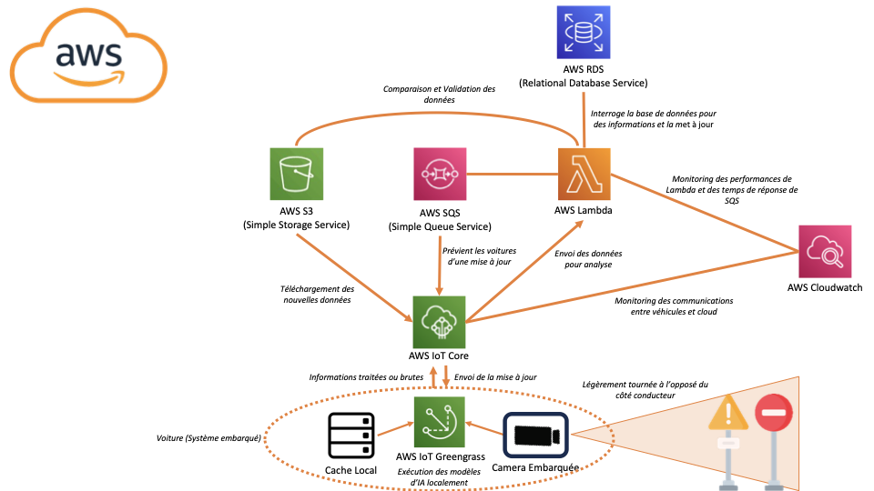
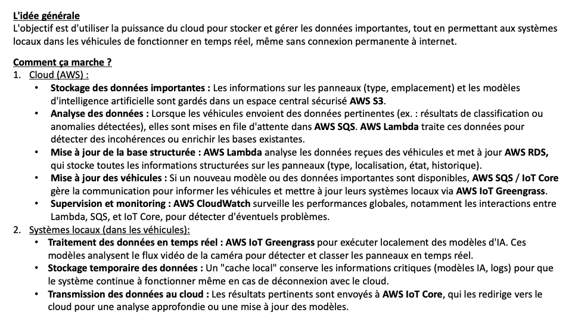
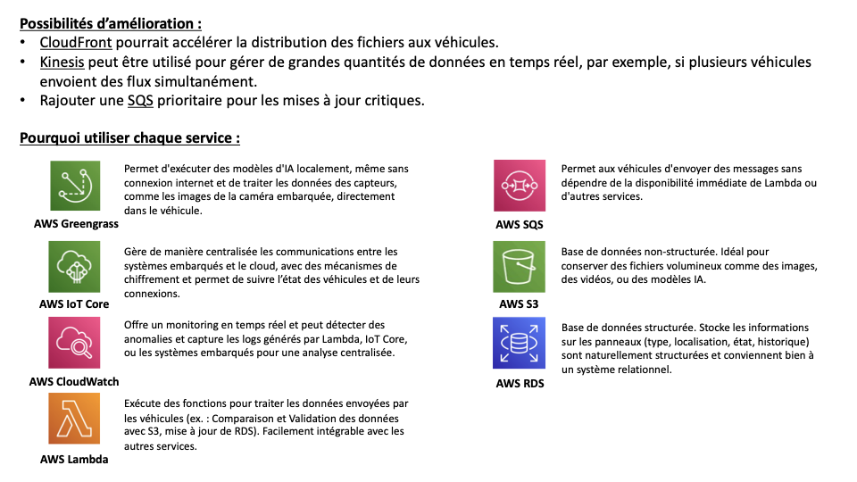

# Système de Détection et de Classification des Panneaux de Signalisation

Ce projet se concentre sur la détection et la classification des panneaux de signalisation à l'aide de flux vidéo en temps réel provenant d'un système de caméra embarqué. En s'appuyant sur des modèles d'IA et une architecture hybride local-cloud.

(Notre PFE ne prend pas en compte la partie détection, pour que le modèle de classification fonctionne il faut un traitement des images détectées et de la data augmentation)

---

   

   

   

---

## Importance d'une \"Carte\" Enregistrée

Une carte enregistrée des panneaux de signalisation joue un rôle crucial pour garantir la fiabilité du système, notamment dans les situations suivantes :

1. **Panneaux Manquants ou Obstrués :**
   - Si des panneaux sont temporairement retirés, cachés ou dégradés (par exemple, à cause des conditions météorologiques, du vandalisme ou des travaux), la carte enregistrée sert de secours, fournissant des informations vitales basées sur les emplacements connus.

2. **Détection de Nouveaux Panneaux ou de Panneaux Manquants :**
   - Lorsqu'un nouveau panneau est détecté, il peut être marqué pour une vérification afin de déterminer sa nature (par exemple, panneaux temporaires pour des travaux). De même, les panneaux manquants peuvent être signalés pour vérifier s'ils ont été retirés volontairement ou s'ils nécessitent un remplacement.

3. **Vérification Manuelle pour Garantir l'Exactitude :**
   - Un processus de vérification manuelle garantit que les changements significatifs, tels que de nouveaux panneaux ou des panneaux critiques manquants, sont correctement reflétés dans la base de données. Cela prévient les risques liés à des informations erronées.

4. **Mises à Jour Dynamiques de la Base de Données :**
   - Un système qui compare continuellement les panneaux détectés avec la base de données existante garantit que tous les changements sont pris en compte. Ce mécanisme de mise à jour dynamique fournit des informations fiables et en temps réel aux conducteurs, réduisant ainsi la confusion et renforçant la sécurité.

---

### Assurer la Sécurité et la Précision

L'intégration d'un système robuste de cartographie et de mise à jour est essentielle pour garantir la sécurité des conducteurs et des passagers.
